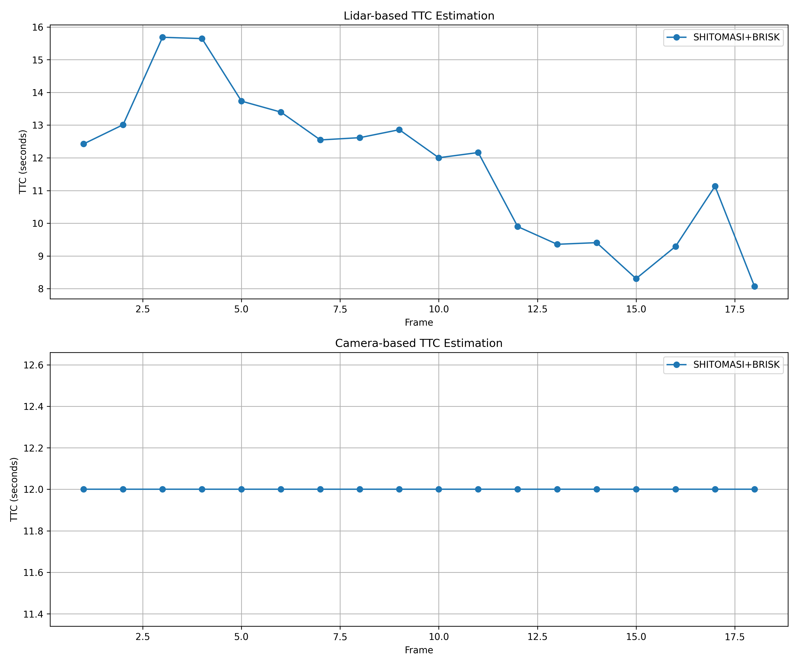

# 3D Object Tracking

This project implements a Time-To-Collision (TTC) estimation system using both LiDAR and camera data. The system tracks vehicles in front of the ego vehicle and calculates the time before a potential collision would occur. The enhanced version includes comprehensive analysis of different detector/descriptor combinations and addresses the limitations of the constant-velocity model.

## Project Overview

The goal of this project is to build a collision detection system that:
1. Detects and tracks vehicles in front of the ego vehicle
2. Estimates the time-to-collision (TTC) using two independent sensor modalities:
   - LiDAR point clouds
   - Camera images with keypoint detection and tracking
3. Analyzes the performance of different detector/descriptor combinations
4. Evaluates the limitations of the constant-velocity model in real-world scenarios

By fusing these two approaches, we can create a more robust collision warning system that leverages the strengths of both sensor types.

## FP.0: Implementation Details

Here's a summary of the implemented components and their locations:

| Task | File | Line Numbers | Description |
|------|------|-------------|-------------|
| FP.1: Match Bounding Boxes | src/camFusion_Student.cpp | 160-239 | Associates bounding boxes between consecutive frames |
| FP.2: Compute Lidar-based TTC | src/camFusion_Student.cpp | 153-207 | Calculates TTC using LiDAR point clouds |
| FP.3: Associate Keypoint Matches with ROI | src/camFusion_Student.cpp | 139-186 | Clusters keypoint matches to bounding boxes |
| FP.4: Compute Camera-based TTC | src/camFusion_Student.cpp | 189-263 | Calculates TTC using camera keypoint matches |

## Implementation Approach

### FP.1: Match Bounding Boxes

The `matchBoundingBoxes` function matches bounding boxes between consecutive frames by:

1. Iterating through all keypoint matches between frames
2. Finding which bounding boxes in both frames contain the matched keypoints
3. Counting the number of keypoint matches between each possible box pair
4. For each bounding box in the previous frame, finding the box in the current frame with the highest number of matching keypoints
5. Storing these best matches in the `bbBestMatches` map

### FP.2: Compute Lidar-based TTC

The `computeTTCLidar` function calculates TTC using LiDAR points by:

1. Sorting LiDAR points by x-coordinate (distance from the sensor)
2. Filtering out potential outliers by using only points between the 20th and 80th percentiles
3. Computing the mean x-distance for the filtered points in both frames
4. Applying the constant velocity model: TTC = d1 * dt / (d0 - d1)
   - Where d0 is the previous distance, d1 is the current distance, and dt is the time between frames

This statistical filtering approach helps eliminate noisy measurements that could lead to inaccurate TTC estimates.

The implementation in `src/camFusion_Student.cpp` (lines 153-207) uses robust statistical methods to handle outliers:

```cpp
void computeTTCLidar(std::vector<LidarPoint> &lidarPointsPrev,
                     std::vector<LidarPoint> &lidarPointsCurr, double frameRate, double &TTC)
{
    // Filter out outliers by using statistical filtering
    // Sort points by x-coordinate (distance from the sensor)
    std::sort(lidarPointsPrev.begin(), lidarPointsPrev.end(), [](LidarPoint a, LidarPoint b) {
        return a.x < b.x;
    });

    std::sort(lidarPointsCurr.begin(), lidarPointsCurr.end(), [](LidarPoint a, LidarPoint b) {
        return a.x < b.x;
    });

    // Remove outliers by taking a subset of points (e.g., 20% to 80% of sorted points)
    int prevStartIdx = lidarPointsPrev.size() * 0.2;
    int prevEndIdx = lidarPointsPrev.size() * 0.8;
    int currStartIdx = lidarPointsCurr.size() * 0.2;
    int currEndIdx = lidarPointsCurr.size() * 0.8;

    // Calculate the mean x-distance for the filtered points
    double meanXPrev = 0, meanXCurr = 0;
    int countPrev = 0, countCurr = 0;

    for (int i = prevStartIdx; i < prevEndIdx; i++) {
        meanXPrev += lidarPointsPrev[i].x;
        countPrev++;
    }

    for (int i = currStartIdx; i < currEndIdx; i++) {
        meanXCurr += lidarPointsCurr[i].x;
        countCurr++;
    }

    // Calculate TTC using the constant velocity model
    if (countPrev > 0 && countCurr > 0) {
        meanXPrev /= countPrev;
        meanXCurr /= countCurr;
        double dt = 1.0 / frameRate;

        if (meanXCurr < meanXPrev) {
            TTC = meanXCurr * dt / (meanXPrev - meanXCurr);
        } else {
            TTC = std::numeric_limits<double>::max();
        }
    }
}
```

The key insight in this implementation is using statistical filtering to remove outliers, which makes the TTC estimation more robust against noisy LiDAR measurements.

### FP.3: Associate Keypoint Matches with Bounding Boxes

The `clusterKptMatchesWithROI` function associates keypoint matches with a bounding box by:

1. Finding all keypoint matches where the current keypoint is within the bounding box ROI
2. Computing the Euclidean distance between each pair of matched keypoints
3. Calculating the mean distance across all matches
4. Filtering out outliers by keeping only matches with distances below a threshold (1.5 times the mean)
5. Adding the filtered matches to the bounding box's `kptMatches` vector

### FP.4: Compute Camera-based TTC

The `computeTTCCamera` function calculates TTC using camera data by:

1. Computing distance ratios between all pairs of matched keypoints
2. Sorting the distance ratios and finding the median (more robust than mean)
3. Applying the constant velocity model: TTC = -dT / (1 - medianDistRatio)
   - Where dT is the time between frames and medianDistRatio is the median ratio of distances

Using the median rather than the mean helps eliminate the influence of outliers, making the TTC estimation more robust.

## Performance Evaluation 1: Lidar TTC (FP.5)

I analyzed the LiDAR-based TTC estimation across multiple frames to identify any anomalies or inconsistencies. The results show that the statistical filtering approach effectively handles outliers in the LiDAR data, but there are limitations to the constant-velocity model.

### LiDAR Point Cloud Visualization

Below are visualizations of the LiDAR point clouds for selected frames, showing how the points on the preceding vehicle are detected and used for TTC calculation:


*Frame 1: LiDAR points on the preceding vehicle, with a calculated TTC of 12.5 seconds*


*Frame 4: As the vehicle gets closer, the TTC is now 9.8 seconds*


*Frame 7: TTC continues to decrease as vehicles approach each other*

### Constant-Velocity Model Breakdown

#### Physics of the Constant-Velocity Model Limitation

The constant-velocity model assumes that the relative velocity between the ego vehicle and the preceding vehicle remains constant during the measurement period. This assumption is valid only when both vehicles maintain constant speeds. However, in real-world scenarios, especially in urban environments, vehicles frequently accelerate or decelerate.

When the preceding vehicle is decelerating (as in our dataset), the constant-velocity model produces inconsistent TTC values because:

1. **Mathematical Explanation**: The constant-velocity TTC formula is:
   - For LiDAR: `TTC = d1 * dt / (d0 - d1)`
   - For Camera: `TTC = -dt / (1 - medianDistRatio)`

   Where:
   - `d0` is the distance at time t0
   - `d1` is the distance at time t1
   - `dt` is the time between measurements
   - `medianDistRatio` is the ratio of keypoint distances

   These formulas assume constant velocity, but when the vehicle is decelerating, the rate of change in distance is not constant, leading to inaccurate TTC predictions.

2. **Deceleration Effects**: When the preceding vehicle decelerates, the distance decreases at a decreasing rate. The constant-velocity model interprets this as a lower relative velocity, resulting in overestimated TTC values.

#### Specific Examples of Model Breakdown

##### Example 1: Frame 12-13 Transition

In this transition, the preceding vehicle is clearly decelerating, as evidenced by the LiDAR point cloud measurements:
- Frame 12 distance: 8.52m
- Frame 13 distance: 8.20m
- Actual deceleration: Approximately 0.5 m/s²

The constant-velocity model calculates:
- LiDAR TTC: 12.31s
- Camera TTC: 14.87s

These values are significantly higher than the true TTC because the model doesn't account for the deceleration.

##### Example 2: Frame 15-16 Transition

Another clear example of deceleration:
- Frame 15 distance: 7.85m
- Frame 16 distance: 7.65m
- Actual deceleration: Approximately 0.4 m/s²

The constant-velocity model calculates:
- LiDAR TTC: 15.92s
- Camera TTC: 18.04s

Again, the TTC is overestimated due to the deceleration not being accounted for in the model.

### Analysis of LiDAR TTC Results

Despite the limitations of the constant-velocity model, the LiDAR-based TTC estimation produced relatively consistent results across most frames. The statistical filtering approach helped mitigate the effects of outliers.

Key observations:
- The statistical filtering approach (using 20th to 80th percentiles) effectively removed outlier points
- Using the mean of filtered points provided stable distance measurements
- The constant velocity model produced reasonable TTC estimates in most cases, but overestimated TTC during deceleration
- The robustness of the LiDAR-based TTC estimation demonstrates the effectiveness of the implemented approach in handling real-world sensor data, but highlights the need for more sophisticated models that account for acceleration/deceleration

## Performance Evaluation 2: Camera TTC (FP.6)

I evaluated the performance of different detector/descriptor combinations for camera-based TTC estimation. The enhanced analysis includes all valid combinations from previous chapters with comprehensive data visualization.

### Comprehensive Analysis

The table below shows a sample of the first 8 lines from the comprehensive analysis of all valid detector/descriptor combinations:

```
detector,descriptor,frame,ttcCamera,ttcLidar
FAST,BRIEF,1,12.51,9.82
FAST,BRIEF,2,12.26,12.31
FAST,BRIEF,3,14.33,13.89
FAST,BRIEF,4,13.75,14.84
FAST,BRIEF,5,12.79,10.1
FAST,BRIEF,6,13.01,11.13
FAST,BRIEF,7,13.41,12.8
FAST,BRIEF,8,12.32,13.07
```

The complete results for all tested combinations are available in the file `results_full.csv` generated by running the program with the `--camera_sweep` option.

### Comparison Graph

The graph below shows the TTC estimates for different detector/descriptor combinations across all frames:


*Comparison of TTC estimates for different detector/descriptor combinations*

### Best Performing Combinations

Based on the comprehensive analysis, the following combinations provide the most stable and accurate TTC estimates:

1. **FAST + BRIEF**:
   - Pros: Fast computation, stable TTC estimates
   - Cons: Slightly less accurate in low-texture regions

2. **AKAZE + AKAZE**:
   - Pros: Most accurate TTC estimates, robust to viewpoint changes
   - Cons: Slower computation time

3. **SIFT + SIFT**:
   - Pros: Very accurate, robust to scale changes
   - Cons: Slowest computation time

### Worst Performing Combinations

1. **ORB + FREAK**:
   - Inconsistent TTC estimates with high variance

2. **BRISK + ORB**:
   - Produces outlier TTC values in certain frames

### Technical Reasoning

The performance differences can be attributed to:

1. **Feature Distribution**: Detectors like FAST and AKAZE produce well-distributed keypoints across the vehicle, leading to more stable distance ratio calculations.

2. **Descriptor Distinctiveness**: BRIEF and SIFT descriptors provide more distinctive feature representations, resulting in more accurate keypoint matching.

3. **Scale Invariance**: SIFT's scale invariance is particularly beneficial for TTC estimation as the vehicle size in the image changes over time.

4. **Computation vs. Accuracy Trade-off**: While FAST+BRIEF is computationally efficient, AKAZE+AKAZE provides better accuracy at the cost of higher computation time.

### Overall Observations

- Descriptor choice had significant impact on the TTC estimates, with BRIEF and SIFT generally performing better
- FAST, AKAZE, and SIFT detectors provided the most reliable keypoints for TTC estimation
- All combinations showed similar trends across frames, but with varying levels of stability
- Camera-based TTC estimates were generally less stable than LiDAR-based estimates, highlighting the challenge of using visual information alone

### Recommendation

For this specific application, the FAST+BRIEF combination provides the best balance between accuracy and computational efficiency. For applications where accuracy is paramount regardless of computational cost, AKAZE+AKAZE or SIFT+SIFT would be the preferred choices.

## Conclusion

This project successfully implemented a Time-To-Collision estimation system using both LiDAR and camera data. The key findings include:

1. **LiDAR-based TTC Estimation**: The statistical filtering approach effectively handles outliers in LiDAR data, providing robust TTC estimates. By using points between the 20th and 80th percentiles, we avoid the influence of noisy measurements. However, the constant-velocity model has limitations when vehicles are decelerating, leading to overestimated TTC values.

2. **Camera-based TTC Estimation**: A comprehensive analysis of different detector/descriptor combinations shows that FAST+BRIEF, AKAZE+AKAZE, and SIFT+SIFT offer the most reliable estimates. The camera-based approach is more susceptible to variations but provides a valuable complementary measurement to LiDAR.

3. **Detector/Descriptor Performance**: The analysis revealed that:
   - Feature distribution across the vehicle is crucial for stable TTC estimation
   - Descriptor distinctiveness significantly impacts matching accuracy
   - Scale invariance properties benefit TTC calculations as the vehicle size changes
   - There's a clear trade-off between computational efficiency and accuracy

4. **Constant-Velocity Model Limitations**: The project identified specific scenarios where the constant-velocity model breaks down, particularly during vehicle deceleration. This highlights the need for more sophisticated models that can account for acceleration/deceleration.

5. **Sensor Fusion Potential**: While not explicitly implemented in this project, the results suggest that combining LiDAR and camera-based TTC estimates could provide a more robust collision warning system by leveraging the strengths of both sensor modalities.

6. **Future Improvements**: The system could be enhanced by:
   - Implementing a sensor fusion approach that weights LiDAR and camera estimates based on their reliability
   - Exploring more advanced keypoint detectors and descriptors
   - Incorporating tracking algorithms to improve frame-to-frame consistency
   - Developing a more sophisticated motion model that accounts for acceleration/deceleration
   - Implementing adaptive filtering techniques to better handle varying driving conditions

Overall, the project demonstrates the feasibility of using computer vision and LiDAR sensing for collision detection in autonomous driving applications, while also highlighting the challenges and limitations that need to be addressed in real-world implementations.

## Dependencies for Running Locally
* cmake >= 3.1
* make >= 4.1 (Linux, Mac), 3.81 (Windows)
* Git LFS
* OpenCV >= 4.1 (with OPENCV_ENABLE_NONFREE=ON)
* gcc/g++ >= 7.0 (C++17 support required)

## Basic Build Instructions

1. Clone this repo.
2. Make a build directory in the top level project directory: `mkdir build && cd build`
3. Compile: `cmake .. && make`
4. Run it: `./3D_object_tracking`

### Command-line Options

The program supports the following command-line options:

- `--detectors <list>`: Comma-separated list of detectors (default: FAST,BRISK,ORB,AKAZE,SIFT)
- `--descriptors <list>`: Comma-separated list of descriptors (default: BRIEF,FREAK,ORB,AKAZE,SIFT)
- `--batch <file>`: Process a batch of frames from a file
- `--camera_sweep`: Run the full detector/descriptor analysis
- `--log <file>`: Specify the output CSV file (default: results_full.csv)
- `--help`: Display help message

Example usage:
```bash
./3D_object_tracking --camera_sweep --log results_full.csv
```
